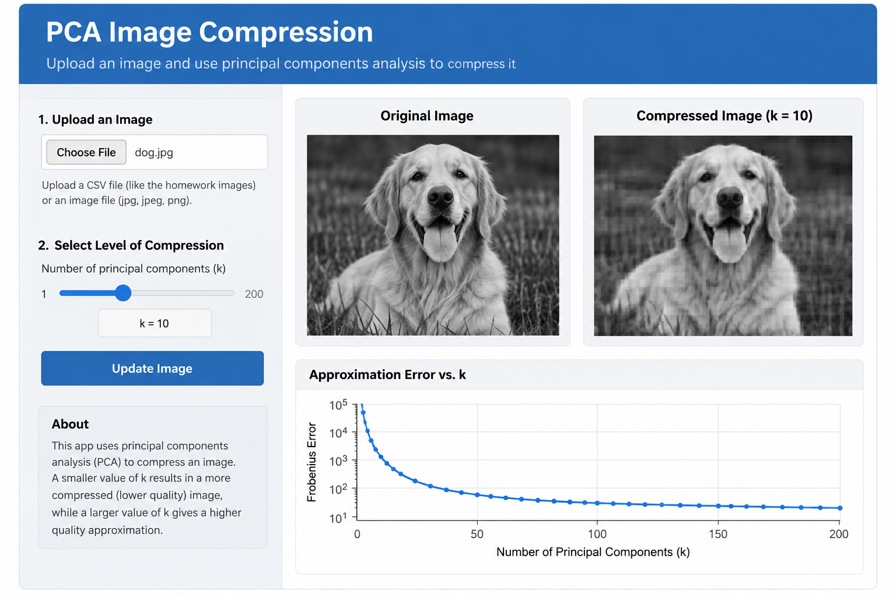
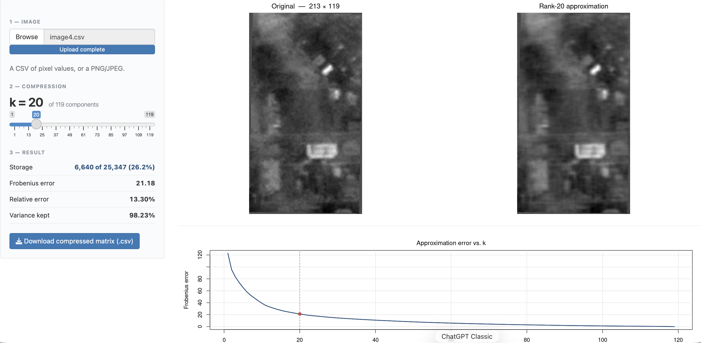

# App Design

I would design an interactive application that allows users to explore how PCA can be used for image compression.

The app would have a control panel on the left side where users can upload an image and select the number of principal components, k, using a slider.

The main portion of the app would display the original image and compressed image side by side. This would allow users to easily see how changing k affects the quality of the image.

A smaller value of k would produce greater compression but lose more image detail. A larger value of k would retain more information from the original image.

# App Mockup Using ChatGPT

```{r, echo=FALSE, out.width="100%"}

```

# Actual App

```{r, echo=FALSE, out.width="100%"}

```

# Layout

The app would contain three main steps:

1. **Upload Image:** A file upload button would be located at the top of the left control panel.
2. **Select Compression Level:** A slider underneath the upload button would allow the user to select k.
3. **Compare Results:** The original image and PCA-compressed image would appear side by side.

I chose this layout because the controls remain separate from the results, while the side-by-side images make visual comparison easy.